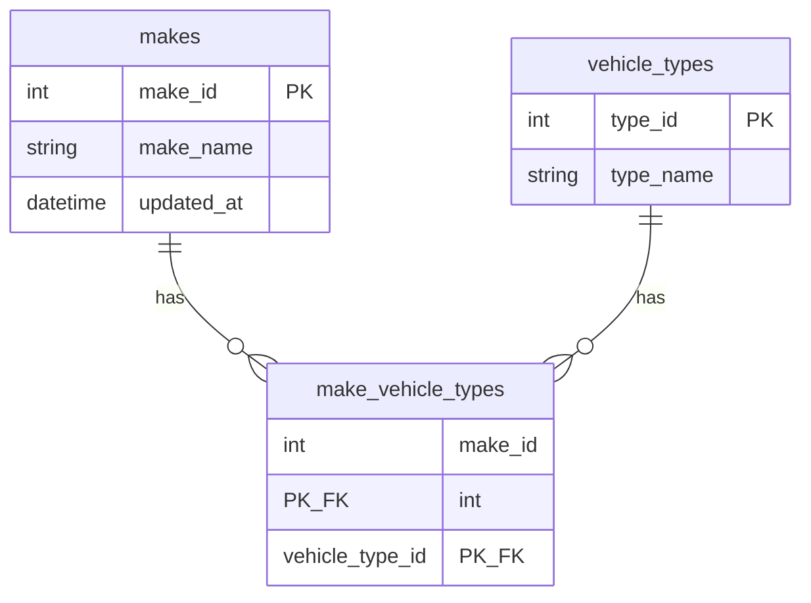

# Vehicle Data Service

A backend service that ingests vehicle data (XML) from the public [NHTSA vPIC API](https://vpic.nhtsa.dot.gov/api/), transforms it into a unified JSON structure, persists it in PostgreSQL and exposes it through a single GraphQL endpoint.

Built with **NestJS + TypeScript**, following a clean (hexagonal) architecture with a strict separation between domain, application, infrastructure and presentation layers.

## Table of Contents

- [Getting Started](#getting-started)
  - [Option A: Run everything with Docker](#option-a-run-everything-with-docker)
  - [Option B: Run locally for development](#option-b-run-locally-for-development)
- [Trying It Out](#trying-it-out)
- [Running the Tests](#running-the-tests)
- [Configuration](#configuration)
- [GraphQL API](#graphql-api)
- [Data Model](#data-model)
- [Project Structure](#project-structure)
- [Further Documentation](#further-documentation)

## Getting Started

There are two ways to get the service running. If you just want to see it working, Docker is the fastest path. If you plan to poke around the code, the local setup gives you hot reload.

### Option A: Run everything with Docker

The only thing you need installed is Docker.

```bash
docker compose up --build
```

That single command starts PostgreSQL, applies the database migrations automatically and boots the service. When the logs settle, everything is ready at:

| URL | What it is |
|---|---|
| `http://localhost:3000/graphql` | GraphQL endpoint, with an interactive GraphiQL IDE |
| `http://localhost:3000/health` | Liveness probe |
| `http://localhost:3000/health/ready` | Readiness probe, checks database connectivity |

If port 3000 is already taken on your machine, pick another one:

```bash
APP_PORT=3200 docker compose up --build
```

### Option B: Run locally for development

You need Node.js 20 or newer, plus Docker for the database.

**Step 1.** Install the dependencies:

```bash
npm install
```

**Step 2.** Create your environment file from the template. The defaults work out of the box:

```bash
cp .env.example .env
```

**Step 3.** Start PostgreSQL in the background:

```bash
docker compose up -d postgres
```

**Step 4.** Apply the migrations and generate the Prisma client:

```bash
npx prisma migrate dev
```

**Step 5.** Start the service in watch mode:

```bash
npm run start:dev
```

The service is now listening on `http://localhost:3000` and will reload whenever you change a file.

To build and run the production bundle instead:

```bash
npm run build
npm run start:prod
```

## Trying It Out

The easiest way to explore the API is the GraphiQL IDE. Open `http://localhost:3000/graphql` in your browser and you get an interactive playground with autocomplete and the full schema documentation.

**1. Trigger an ingestion.** This fetches the makes catalog from NHTSA, enriches each make with its vehicle types and persists everything:

```graphql
mutation {
  triggerIngestion {
    totalMakesDiscovered
    makesProcessed
    makesSucceeded
    makesFailed
    vehicleTypesLinked
    durationMs
  }
}
```

A quick heads up: the full NHTSA dataset is around 12,000 makes, and each one requires its own API call, so a complete ingestion takes a while. For a quick demo, limit it to a small sample first:

```bash
INGESTION_MAKE_LIMIT=100 docker compose up --build
```

With a limit of 100 the whole ingestion finishes in a few seconds. Set it back to `0` (or remove it) to ingest everything.

If you prefer the terminal over the browser:

```bash
curl -s http://localhost:3000/graphql \
  -H 'Content-Type: application/json' \
  -d '{"query":"mutation { triggerIngestion { makesProcessed makesSucceeded makesFailed durationMs } }"}'
```

**2. Query the ingested data.** Search, paginate and read the unified shape:

```graphql
query {
  makes(limit: 10, offset: 0, search: "tesla") {
    total
    items {
      makeId
      makeName
      vehicleTypes {
        typeId
        typeName
      }
    }
  }
}
```

**3. Run the ingestion again.** It is idempotent, so re-running it updates the existing rows without creating duplicates. Feel free to trigger it twice and confirm the totals stay consistent.

**4. Check the health endpoints:**

```bash
curl http://localhost:3000/health
curl http://localhost:3000/health/ready
```

## Running the Tests

The test suites do not need a database or network access, so you can run them right after `npm install`:

```bash
npm test           # unit tests
npm run test:e2e   # end to end tests
npm run test:cov   # unit tests with a coverage report
npm run lint       # ESLint + Prettier
```

What each suite covers:

- **Unit tests** exercise the XML to JSON transformation (`NhtsaXmlMapper`), the ingestion orchestration, the retry and concurrency utilities, and the environment validation. Every external call is mocked.
- **E2E tests** boot the real NestJS application and hit the GraphQL endpoint over HTTP, with the NHTSA data source mocked and an in-memory repository. They verify the full flow: ingestion, persistence, queries, search, error mapping and input validation.

## Configuration

All configuration comes from environment variables, every one has a sensible default, and the whole set is **validated with Zod on startup**. If a variable is invalid the service refuses to boot and tells you exactly which one and why. See [`src/config/env.validation.ts`](src/config/env.validation.ts).

| Variable | Default | Description |
|---|---|---|
| `NODE_ENV` | `development` | `development`, `test` or `production` |
| `PORT` | `3000` | HTTP port |
| `LOG_LEVEL` | `info` | `fatal`, `error`, `warn`, `info`, `debug` or `trace` |
| `DATABASE_URL` | (required) | PostgreSQL connection string |
| `NHTSA_API_BASE_URL` | `https://vpic.nhtsa.dot.gov/api` | External API base URL |
| `NHTSA_REQUEST_TIMEOUT_MS` | `15000` | Timeout per outgoing request |
| `NHTSA_MAX_RETRIES` | `3` | Max retries with exponential backoff |
| `INGESTION_CONCURRENCY` | `10` | Parallel vehicle type requests during ingestion (max 50) |
| `INGESTION_MAKE_LIMIT` | `0` | Limit of makes to ingest; `0` means all (~12k). Useful for demos |
| `INGESTION_BATCH_SIZE` | `500` | Makes persisted per database batch |
| `INGESTION_CRON_ENABLED` | `false` | Feature flag for scheduled ingestion |
| `INGESTION_CRON_EXPRESSION` | `0 3 * * *` | Cron expression for scheduled ingestion |

## GraphQL API

The schema is generated code first and written to [`schema.gql`](schema.gql). GraphiQL is enabled at `/graphql` outside production.

### Queries

```graphql
query {
  makes(limit: 10, offset: 0, search: "aston") {
    total
    limit
    offset
    items {
      makeId
      makeName
      vehicleTypes {
        typeId
        typeName
      }
    }
  }
}
```

```graphql
query {
  make(makeId: 440) {
    makeId
    makeName
    vehicleTypes { typeId typeName }
  }
}
```

### Mutations

```graphql
mutation {
  triggerIngestion {
    totalMakesDiscovered
    makesProcessed
    makesSucceeded
    makesFailed
    vehicleTypesLinked
    durationMs
    failures { makeId makeName reason }
  }
}
```

Errors are returned with stable, machine readable codes in `extensions.code`:
`EXTERNAL_API_ERROR`, `XML_PARSE_ERROR`, `TRANSFORMATION_ERROR`, `PERSISTENCE_ERROR`, `INGESTION_ERROR`, `INTERNAL_SERVER_ERROR`.

## Data Model

Data is stored normalized in PostgreSQL, managed with Prisma migrations:



The GraphQL layer reassembles this into the required unified JSON shape:

```json
[
  {
    "makeId": 440,
    "makeName": "ASTON MARTIN",
    "vehicleTypes": [
      { "typeId": 2, "typeName": "Passenger Car" },
      { "typeId": 7, "typeName": "Multipurpose Passenger Vehicle (MPV)" }
    ]
  }
]
```

Ingestion is **idempotent**: makes and vehicle types are upserted, and the links between them are replaced on each run, so re-running an ingestion refreshes existing data without duplicates.

## Project Structure

```
src/
├── config/           Env validation (Zod) + typed configuration service
├── common/utils/     Reusable concurrency and retry primitives
├── domain/           Entities, ports (interfaces) and domain errors, no framework deps
├── application/      Use cases orchestrating domain ports
├── infrastructure/   Adapters: NHTSA client, XML mapper, Prisma repository
└── presentation/     GraphQL resolvers and models, health endpoints, scheduler
```

See [docs/ARCHITECTURE.md](docs/ARCHITECTURE.md) for the full architecture rationale, the ingestion pipeline internals and the error handling and logging strategy.

## Further Documentation

- [docs/ARCHITECTURE.md](docs/ARCHITECTURE.md) covers the architecture, ingestion pipeline, error handling, logging and scalability notes
- [schema.gql](schema.gql) is the generated GraphQL schema
- [prisma/schema.prisma](prisma/schema.prisma) is the database schema
- [.env.example](.env.example) is the documented configuration template
