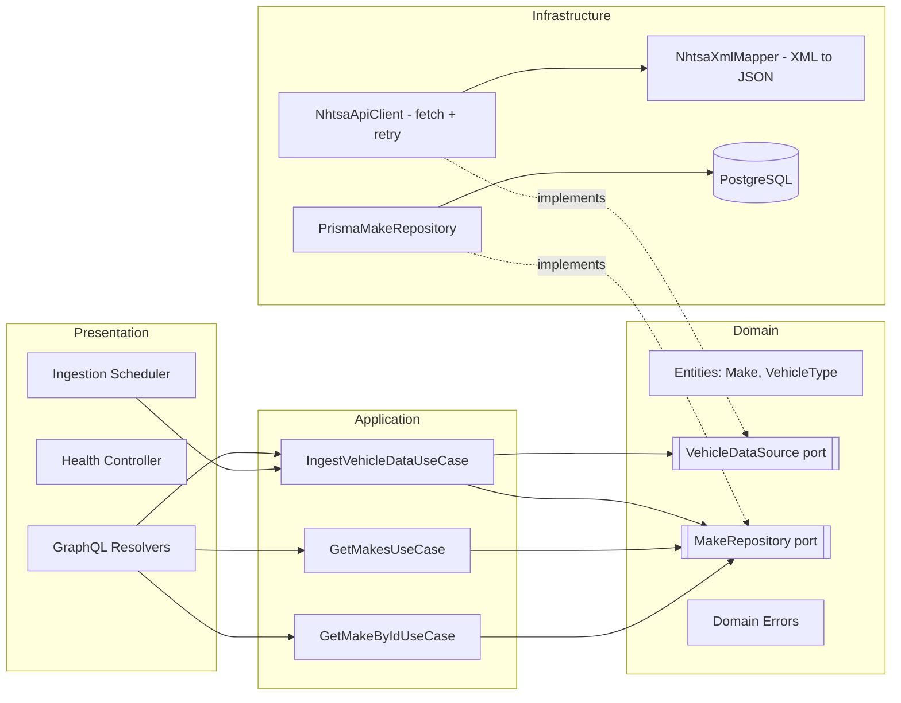
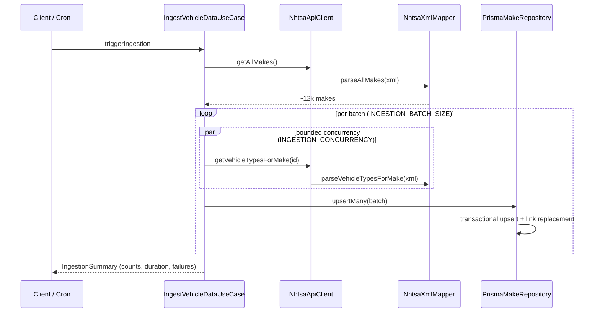

# Architecture

## Overview

The service follows a **clean (hexagonal) architecture**. Dependencies always point inward: presentation and infrastructure depend on application and domain; the domain depends on nothing.

**Why ports & adapters?** The application layer only knows the `VehicleDataSource` and `MakeRepository` interfaces (bound via Nest DI tokens). This makes the ingestion logic trivially testable with mocks, and means swapping PostgreSQL for another datastore, or the XML API for another provider, only requires a new adapter in `infrastructure/`.

## Ingestion Pipeline

Key decisions:

- **Bounded concurrency** (`mapWithConcurrency`, default 10): ~12k vehicle-type requests would be far too slow sequentially and would hammer the API fully parallel. The worker-pool utility keeps a fixed number of requests in flight.
- **Retry with exponential backoff + jitter** (`withRetry`): transient failures (timeouts, 429/5xx) are retried; client errors (e.g. 404) are not.
- **Per-make failure isolation**: a failing make is recorded in the summary's `failures` list and never aborts the run.
- **Batched, transactional persistence**: results are flushed to PostgreSQL every `INGESTION_BATCH_SIZE` makes, keeping memory bounded and giving incremental progress on long runs.
- **Idempotency**: makes/types are upserted by their natural NHTSA IDs and make↔type links are replaced per batch, so re-ingestion is safe (no duplicates, stale links removed).
- **Single-flight guard**: concurrent `triggerIngestion` calls are rejected with `INGESTION_ERROR` while a run is in progress.

## Error Handling Strategy

Errors are modeled as a typed hierarchy in the domain layer (`DomainError`):

| Error | Code | Raised when |
|---|---|---|
| `ExternalApiError` | `EXTERNAL_API_ERROR` | Network failure or non-2xx HTTP response from NHTSA |
| `XmlParseError` | `XML_PARSE_ERROR` | Malformed/empty XML payload |
| `TransformationError` | `TRANSFORMATION_ERROR` | XML shape or field values don't match expectations |
| `PersistenceError` | `PERSISTENCE_ERROR` | Database insertion/query failure |
| `IngestionError` | `INGESTION_ERROR` | Pipeline-level failure (e.g. concurrent run) |

Handling rules:

1. **Graceful degradation**: during ingestion, per-make errors are captured and reported, not thrown.
2. **Fail fast where it matters**: invalid configuration aborts startup; a failure to list makes aborts the run (nothing sensible can proceed).
3. **Typed GraphQL errors**: a global exception filter maps `DomainError`s to GraphQL errors with stable `extensions.code` values, and shields stack traces/internal details of unexpected exceptions behind `INTERNAL_SERVER_ERROR`.

## Logging Strategy

Structured JSON logging via **Pino** (`nestjs-pino`):

- JSON output in production; pretty-printed single-line logs in development.
- HTTP requests are auto-logged with request IDs; `authorization` headers are redacted.
- Explicitly logged events: startup/shutdown (incl. SIGTERM/SIGINT), ingestion start/end with metrics, batch progress, external API retries and failures, transformation errors, DB failures, and unexpected exceptions (via `LoggerErrorInterceptor`).
- Log level is configurable via `LOG_LEVEL` and validated at startup.

## Configuration Approach

- All settings come from environment variables (12-factor).
- A single Zod schema (`src/config/env.validation.ts`) documents, defaults, coerces and validates every variable; the service **fails fast on startup** with a precise message if configuration is invalid.
- A typed `AppConfigService` exposes grouped, readonly config (`nhtsa`, `ingestion`, `database`) so consumers never touch `process.env`.
- Feature flag example: `INGESTION_CRON_ENABLED` toggles scheduled ingestion without code changes.
- `NODE_ENV` switches environment-specific behavior (log formatting, GraphiQL availability).

## Scalability Notes

- **Ingestion throughput** scales with `INGESTION_CONCURRENCY` (bounded by NHTSA rate limits) and is memory-safe due to batch flushing.
- **Read path** is a normalized schema with an index on make name; list queries are paginated (capped at 200 items) and fetch vehicle types via a single `include` (no N+1).
- **Horizontal scaling**: the service is stateless apart from the in-process single-flight ingestion guard; in a multi-replica deployment that guard (and the cron trigger) should move to a distributed lock or queue (e.g. BullMQ), a deliberate trade-off kept simple for this challenge.
- **Evolution path**: because ingestion is behind a port, it could be moved to a background worker consuming from a queue without touching domain or presentation code.
